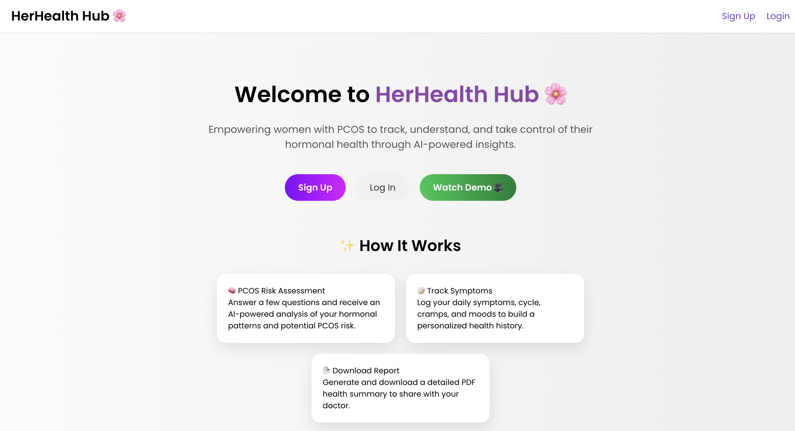
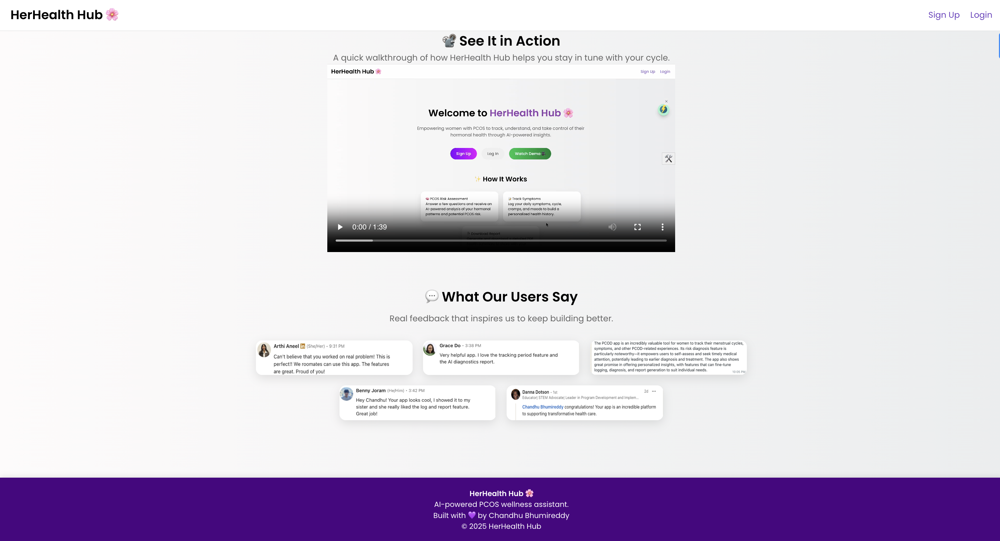
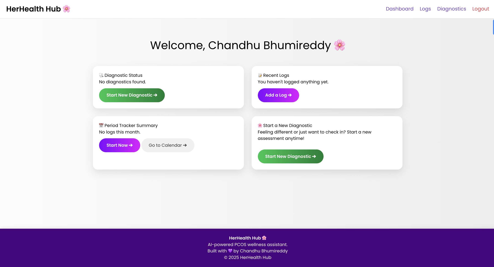
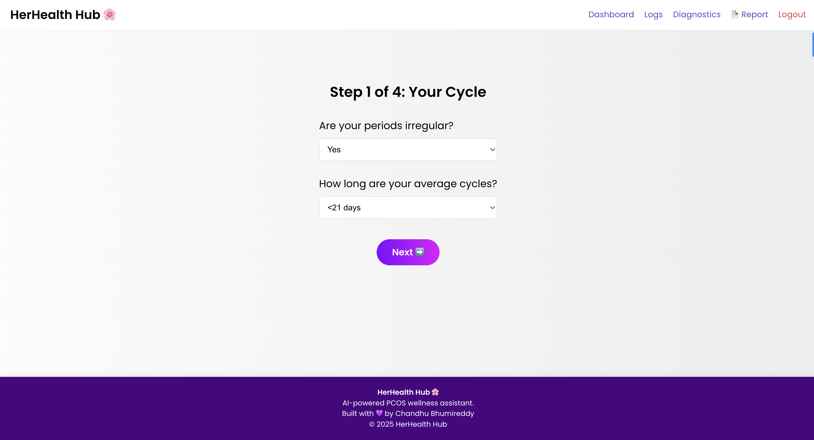
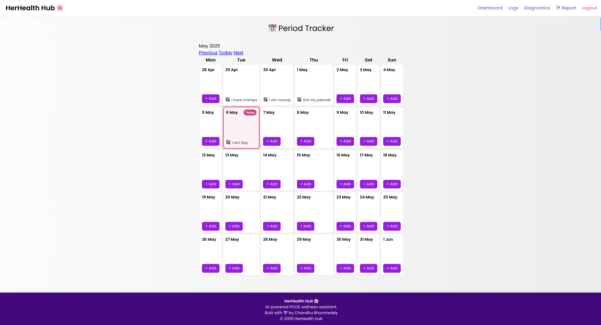
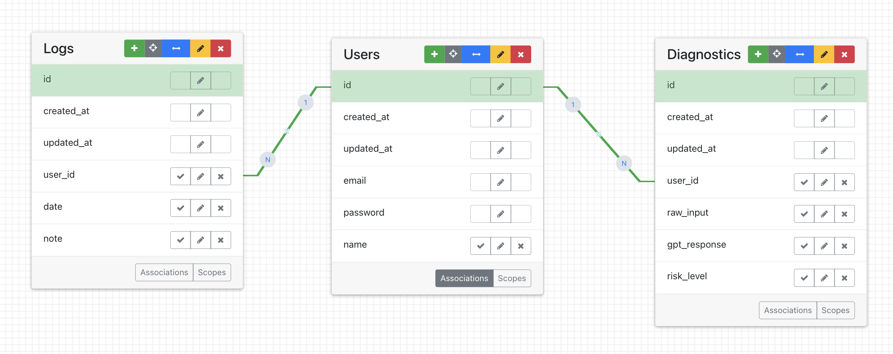

# HerHealth Hub 🌸

## Description
**HerHealth Hub** is a wellness web application designed to support women managing PCOS/PCOD. It empowers users to assess their hormonal health through an AI-assisted diagnostic quiz, track symptoms, and generate insightful health summaries. Built with empathy and purpose, the platform aims to make early detection and self-awareness more accessible.

---

## Table of Contents
- [Features](#features)
- [Installation](#installation)
- [Usage](#usage)
- [Troubleshooting](#troubleshooting)
- [Contributing](#contributing)
- [ERD](#erd)
- [License](#license)
- [Contact Information](#contact-information)

---

## Features
- **PCOS Risk Assessment**: Multi-step wizard form to analyze symptoms and provide AI-generated insights.
- **Symptom Tracking**: Users can log cycles, cramps, moods, and more using a calendar-based period tracker.
- **PDF Report Generation**: Download health reports including logs and AI feedback for clinical discussions.
- **User Authentication**: Devise integration for secure registration and session management.
- **Responsive Design**: Fully responsive across desktop, tablet, and mobile.
- **Empathetic UX**: Soft visuals, testimonial highlights, and personal user summaries to build trust and clarity.

---

## Installation

1. Clone the repository:
   ```bash
   git clone https://github.com/yourusername/her-health-hub.git
   cd her-health-hub
2. Install dependencies:
    ```bash
    bundle install
3. Set up the database:
    ```bash
    rails db:create
    rails db:migrate
4. Start the Rails server:
    ```bash
    rails server
    ```

## Usage
- Once the server is running:
- Visit http://localhost:3000
- Register or sign in
- Start the diagnostic wizard or add logs from the dashboard
- Download your PCOS summary report as a PDF anytime

## Troubleshooting

### Database not working?
Try:
   ```bash
   rails db:reset
   rails db:migrate
   ```

### Missing gems?
Try:
   ```bash
   bundle install
   bundle update
   ```

### Video/testimonials not loading?
Try: 
   ```bash
   rails assets:precompile
   ```
## Contributing
Contributions are welcome!

Fork the repository

Create a new branch:
   ```bash
   git checkout -b feature-name
   ```

Commit your changes:
   ```bash
   git commit -m 'Added X feature'
   ```

Push to your branch:
   ```bash
   git push origin feature-name
   ```

Open a pull request

## Visual Aids
Here are some visual aids to help you quickly understand the structure and flow of the app:

### The Landing page




### Dashboard page


### Diagnostic page


### Logs page


### Pdf 

## ERD


## License

HerHealth Hub is licensed under the Chandhu Bhumireddy.

## Contact Information

- Chandhu Bhumireddy
- chandhub108@gmail.com
- Project Link: https://github.com/bchandhu/her-health-hub
